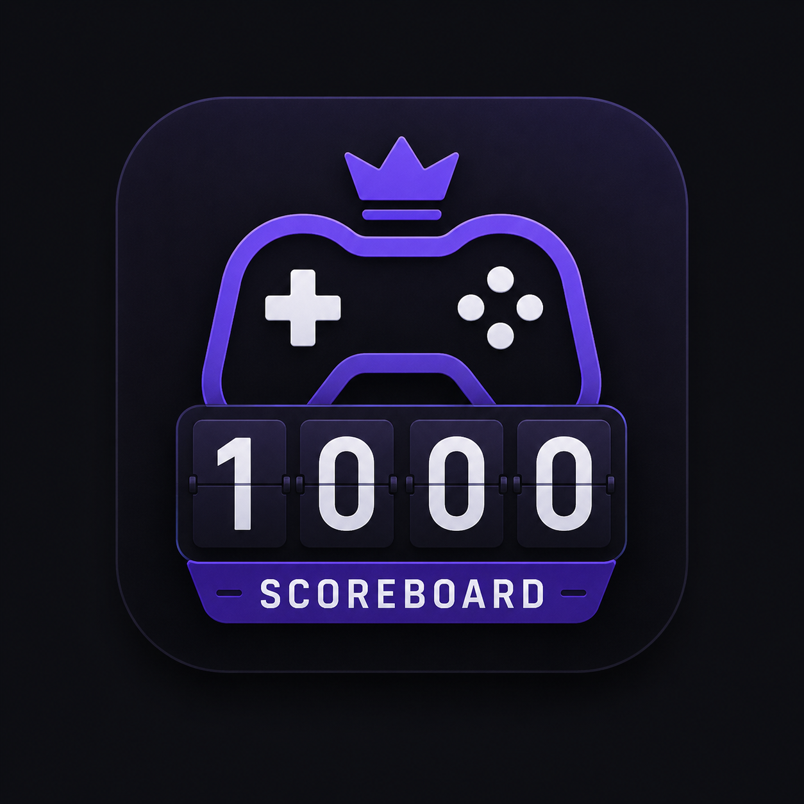

# 🎮 ScoreBoard

Pencatat skor permainan (game score tracker) — first to **1000** wins. Aplikasi web ringan (React via CDN, tanpa build step) yang dibungkus sebagai aplikasi Android native memakai WebView.



## Fitur

- ✅ Kelola pemain — tambah/hapus pemain
- ✅ Input skor per ronde untuk semua pemain
- ✅ Tabel skor real-time + kumulatif
- ✅ Deteksi pemenang otomatis (first to 1000)
- ✅ Reset & clear dengan sekali tap
- ✅ **Persisten** — data tersimpan di `localStorage` (tahan refresh/restart)
- ✅ Tampilan gelap penuh, sticky header dengan safe-area (aman dari status bar HP)
- ✅ Ikon aplikasi memakai `logo.png`

## Teknologi

| Bagian | Teknologi |
|---|---|
| Frontend | React 18 (UMD CDN) + Babel Standalone + Tailwind CSS (CDN) |
| Ikon | Lucide (CDN) |
| Storage | `localStorage` |
| Wrapper Android | Kotlin + WebView (`WebViewAssetLoader`) |
| Build | Gradle 8.13 · AGP 8.13.2 · Kotlin 2.3.21 · compileSdk/targetSdk 36 · minSdk 26 |
| CI/CD | GitHub Actions (debug build otomatis + release-on-tag) |

> Catatan: React/Tailwind/Lucide dimuat dari CDN, jadi butuh internet saat pertama kali dibuka. Service worker tidak aktif di dalam WebView (limitasi platform, tidak berakibat error).

## Struktur Proyek

```
game-score/
├── index.html            # Entry point web
├── css/styles.css        # Styling (Tailwind + custom, termasuk safe-area)
├── js/App.js             # Logika utama aplikasi
├── js/components/        # Komponen UI (Icon, PlayerManager, dst.)
├── icons/logo.png        # Logo aplikasi (96px, untuk header web)
├── logo.png              # Logo sumber (ikon launcher Android)
├── manifest.json         # Web app manifest
├── sw.js                 # Service worker (tidak aktif di WebView)
├── android/              # Proyek Android wrapper (Kotlin WebView)
└── .github/workflows/    # CI/CD GitHub Actions
```

## Build APK Lokal

```bash
# Debug APK
cd android
./gradlew :app:assembleDebug
# → android/app/build/outputs/apk/debug/app-debug.apk

# Release APK (butuh keystore, lihat di bawah)
./gradlew :app:assembleRelease
# → android/app/build/outputs/apk/release/app-release.apk
```

Persyaratan: JDK 17+ (local.properties mengarah ke Android SDK), Android SDK platform 36 + build-tools 36.

### Signing Release

Buat `android/keystore.properties` (jangan di-commit — sudah di `.gitignore`):

```properties
storeFile=../release.keystore
storePassword=***
keyAlias=***
keyPassword=***
```

Generate keystore bila belum punya:

```bash
keytool -genkeypair -v -keystore android/release.keystore \
  -alias scoreboard -keyalg RSA -keysize 2048 -validity 10000
```

## Build Otomatis (GitHub Actions)

Workflow: `.github/workflows/build-apk.yml`

| Pemicu | Hasil |
|---|---|
| Push ke `main` | Debug APK (`ScoreBoard-debug.apk`) sebagai artifact → Actions → Artifacts |
| Tag `v*` (mis. `v1.0.0`) | Release APK signed + dibuatkan GitHub Release otomatis dengan lampiran APK |

Untuk build release otomatis, set 4 secrets di repo (Settings → Secrets and variables → Actions):

| Secret | Isi |
|---|---|
| `KEYSTORE_BASE64` | `base64 -w0 android/release.keystore` |
| `KEYSTORE_PASSWORD` | password store keystore |
| `KEY_ALIAS` | alias (contoh: `scoreboard`) |
| `KEY_PASSWORD` | password key |

Lalu rilis versi baru tinggal:

```bash
git tag v1.0.0
git push origin v1.0.0
```

## Lisensi

MIT